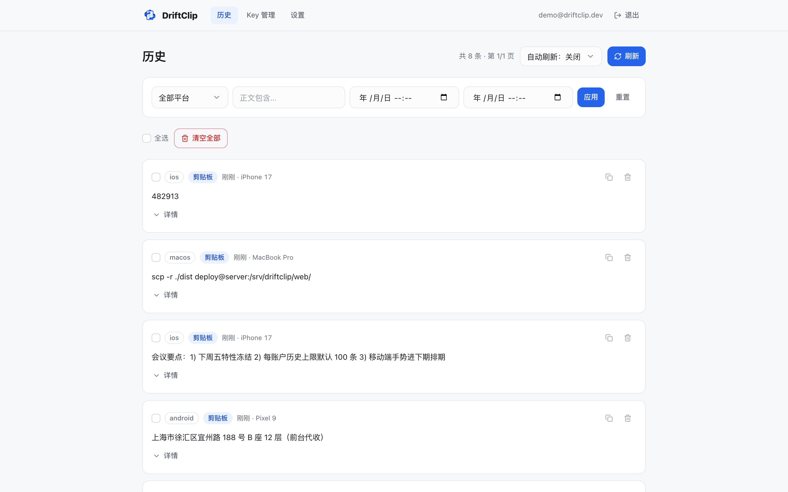
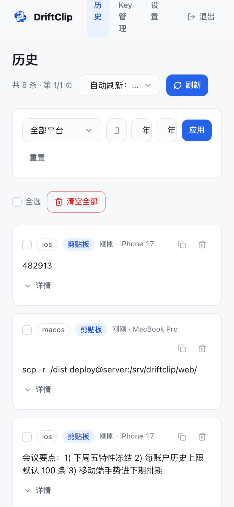
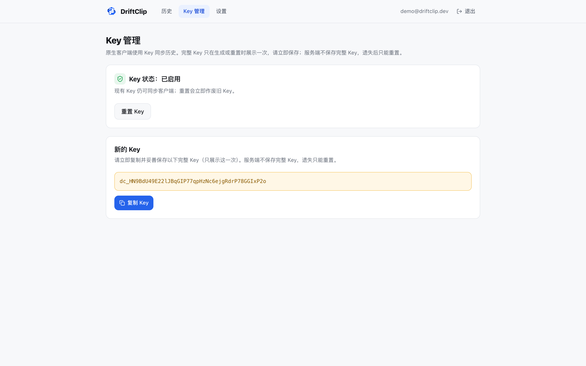

# DriftClip

**自托管的剪贴板历史服务：一台设备上复制，所有设备上找回。**

[](https://github.com/JeckChen666/DriftClip/actions/workflows/ci.yml)
[](https://github.com/JeckChen666/DriftClip/releases)
[](LICENSE)

[English](README.md) | 简体中文

DriftClip 采集你在各设备上复制的文本，集中保存成一份可搜索的同步历史。服务端跑在你自己的机器或 VPS 上，通过 Web 或原生客户端登录，链接、命令、地址再也不怕复制后找不回。

- 数据完全在你自己控制的基础设施上——单个 Go 二进制 + SQLite，不依赖任何外部服务
- 多用户，数据按账户严格隔离；Web 用邮箱密码登录，原生客户端用账户级 API Key 访问
- 支持按平台/正文/时间组合筛选与搜索；可复制、删除、批量删除、清空全部
- 只存纯文本（单条默认上限 100 KiB），并按账户限制历史条数

| Web 历史 | 移动端 |
| --- | --- |
|  |  |

Key 管理（完整 Key 可随时查看和复制）：



## 架构

| 模块 | 技术 | 职责 |
| --- | --- | --- |
| `server/` | Go + SQLite | REST API、鉴权、保留策略、托管构建后的 Web UI |
| `web/` | React + Vite | 浏览器端，查看与管理历史 |
| `client/` | Flutter | 原生客户端（Windows / macOS / Linux / Android / iOS） |

## 快速开始（Docker）

```bash
git clone https://github.com/JeckChen666/DriftClip.git
cd DriftClip/deploy
export DRIFTCLIP_SESSION_SECRET="$(openssl rand -hex 32)"
export DRIFTCLIP_KEY_PEPPER="$(openssl rand -hex 32)"
docker compose up -d --build
```

服务监听 `127.0.0.1:8080`，数据持久化在 `driftclip-data` 卷。应用不直接暴露公网：请自行配置反向代理与 HTTPS，并设置 `DRIFTCLIP_SERVER_TRUSTED_PROXIES`（见 [deploy/docker-compose.yml](deploy/docker-compose.yml)）——开启 `require_https` 后，未经可信 HTTPS 代理转发的请求会被拒绝。

每个 Release 也会向 GHCR 发布预构建镜像：

```bash
docker run -d --name driftclip -p 127.0.0.1:8080:8080 -v driftclip-data:/data \
  -e DRIFTCLIP_DATABASE_PATH=/data/driftclip.sqlite \
  -e DRIFTCLIP_SESSION_SECRET="$(openssl rand -hex 32)" \
  -e DRIFTCLIP_KEY_PEPPER="$(openssl rand -hex 32)" \
  ghcr.io/jeckchen666/driftclip:latest
```

### 首次使用

1. 打开 Web 端（本地即 `http://127.0.0.1:8080`），注册账户。
2. 进入「Key 管理」生成 API Key——完整 Key 由服务端加密保存，可随时在「Key 管理」页查看和复制。
3. 安装原生客户端，在引导/设置页填入服务地址与 Key。
4. 在任意已连接设备上复制内容——所有端的历史里都能看到。

已有部署可关闭注册：`DRIFTCLIP_REGISTRATION_ENABLED=false`。

## 原生客户端

每个 [Release](https://github.com/JeckChen666/DriftClip/releases) 附带 Windows、macOS、Linux、Android 预构建客户端；服务端发行包含二进制、Web UI 与示例配置。

- **macOS**：下载包未签名。若被 Gatekeeper 拦截，执行 `xattr -cr /Applications/DriftClip.app` 去除隔离属性
- **Linux**：需要 Flutter 常见运行库（`libgtk-3-0`、`libblkid1`、`liblzma5` 等）
- **Android**：直接安装 APK
- **iOS**：需用 Xcode 自行构建并签名（是否上架由你决定）

从源码构建：

```bash
cd client
flutter pub get
flutter build macos --release   # windows / linux / apk / ipa 同理
```

## 配置

全部配置见 [deploy/config.example.yaml](deploy/config.example.yaml)，均可用 `DRIFTCLIP_*` 环境变量覆盖。最关键的几项：

| 配置 | 说明 |
| --- | --- |
| `session_secret` / `key_pepper` | 必须替换为强随机值；严禁提交入库或打印到日志 |
| `server.require_https` | 拒绝非 HTTPS 请求（在 TLS 代理后开启） |
| `server.trusted_proxies` | 允许设置 `X-Forwarded-*` 头的代理 CIDR |
| `history.max_history_records` | 每账户历史上限（默认 100），调低重启后立即清理 |
| `history.max_clipboard_text_bytes` | 单条正文上限（默认 100 KiB） |

## 开发

环境要求：Go 1.26+、Node.js 24+、Flutter 3.44+。

```bash
# 服务端（API 在 :8080，存在 web/dist 时一并托管）
cd server && go run ./cmd/driftclip-server
go test ./... && go vet ./...

# Web（dev server 在 :5173，/api 代理到 :8080）
cd web && npm install && npm run dev
npm run lint && npm test

# 客户端
cd client && flutter run -d macos
flutter analyze && flutter test
```

完整调试手册见 [DEVELOPMENT.md](DEVELOPMENT.md)，设计方案与验收标准见 [docs/CLIPBOARD_SYNC_V1_PLAN.md](docs/CLIPBOARD_SYNC_V1_PLAN.md)。

## 贡献与安全

- 欢迎贡献，见 [CONTRIBUTING.md](CONTRIBUTING.md)（中文版见 [CONTRIBUTING.zh-CN.md](CONTRIBUTING.zh-CN.md)）
- 发现安全问题请按 [SECURITY.md](SECURITY.md) 私密报告，请勿直接开公开 issue

## 许可证

[MIT](LICENSE) © JeckChen666
